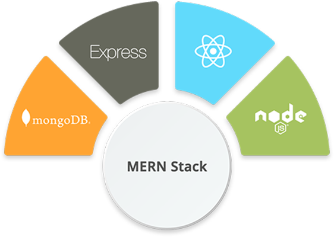
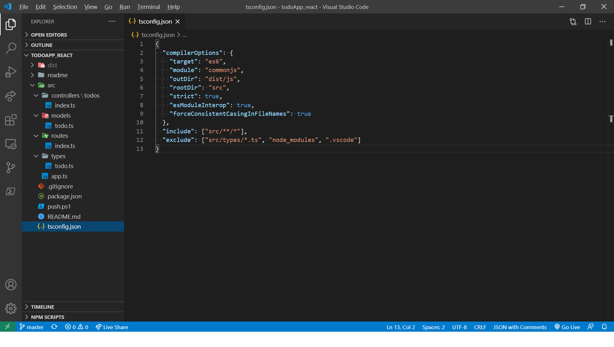
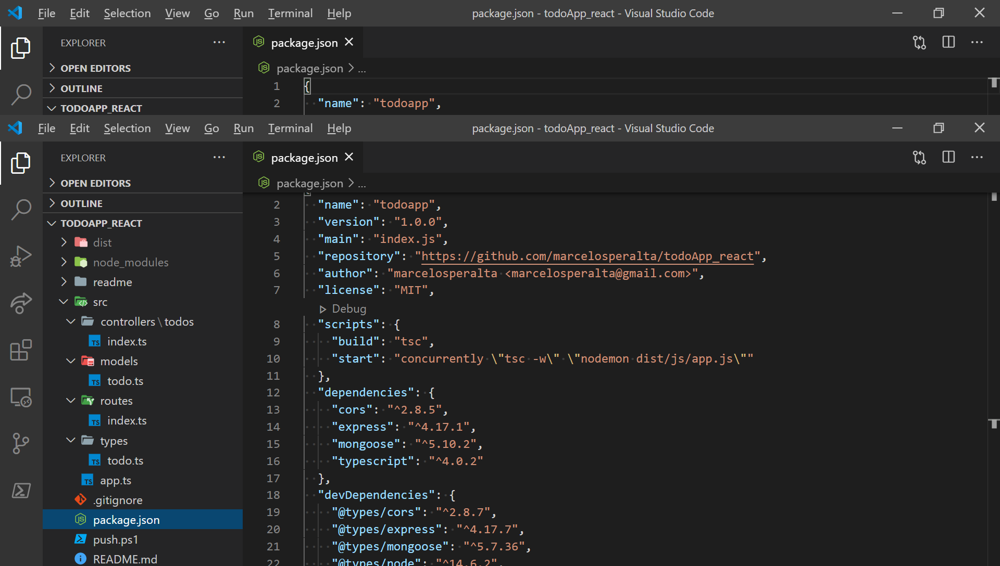

<div align="center">

&nbsp;&nbsp;&nbsp;&nbsp;

</div>

# :white_check_mark: To-do App

A To-do App with [MongoDB](https://www.mongodb.com/), [Express](https://expressjs.com/), [React](https://reactjs.org/), [Node.js](https://nodejs.org/en/), and [TypeScript](https://www.typescriptlang.org/).

## :star: Source

[How to Build a Todo App with React, TypeScript, NodeJS, and MongoDB](https://www.freecodecamp.org/news/how-to-build-a-todo-app-with-react-typescript-nodejs-and-mongodb/) by [Ibrahima Ndaw](https://github.com/ibrahima92) on [freeCodeCamp.org](https://www.freecodecamp.org/)

## :fire: Getting Started

### :dvd: Generate the ```tsconfig.json```

```
yarn init -y
```

### :heavy_minus_sign: Structure of the project

```
├── dist
├── node_modules
├── src
   ├── app.ts
   ├── controllers
   |  └── todos
   |     └── index.ts
   ├── models
   |  └── todo.ts
   ├── routes
   |  └── index.ts
   └── types
      └── todo.ts
├── nodemon.json
├── package.json
├── tsconfig.json
```

### ⚙ Configuring TypeScript with [tsconfig](https://www.typescriptlang.org/docs/handbook/tsconfig-json.html) using [tsc](https://www.typescriptlang.org/docs/handbook/release-notes/typescript-1-6.html#--init-command-line-option)

```
tsc --init
```

Delete the ```tsconfig.json``` original settings and paste the text below:

```
{
  "compilerOptions": {
    "target": "es6",
    "module": "commonjs",
    "outDir": "dist/js",
    "rootDir": "src",
    "strict": true,
    "esModuleInterop": true,
    "forceConsistentCasingInFileNames": true
  },
  "include": ["src/**/*"],
  "exclude": ["src/types/*.ts", "node_modules", ".vscode"]
}
```

:black_small_square: ```outDir:``` tells the compiler to put the compiled code into the dist/js folder.  
:black_small_square: ```rootDir:``` informs TypeScript to compile every .ts file located in the src folder.  

:black_small_square: ```include:``` tells the compiler to include files that are in the src directory and sub-directory.  
:black_small_square: ```exclude:``` will exclude the files or folders passed in the array during compile-time.  



### :dvd: Install the dependencies to enable [TypeScript](https://www.typescriptlang.org/)  

```
yarn add typescript -g
```

### :dvd: Install the dependencies [Express](https://expressjs.com/), [CORS](https://github.com/expressjs/cors), and [Mongoose](https://mongoosejs.com/) to use [Express](https://expressjs.com/) and [MongoDB](https://www.mongodb.com/)  

```
yarn add express cors mongoose
```

:heavy_exclamation_mark: install their types as development dependencies to help the TypeScript compiler understand the packages.

:loudspeaker: see _[type declarations](https://www.typescriptlang.org/docs/handbook/declaration-files/consumption.html)_

```
yarn add -D @types/node @types/express @types/mongoose @types/cors
```


### :dvd: Install the dependencies [Concurrently](https://github.com/kimmobrunfeldt/concurrently#readme), and [nodemon](https://nodemon.io/)  


[Concurrently](https://github.com/kimmobrunfeldt/concurrently#readme) will help compile the TypeScript code, keep watching for changes, and also start the server simultaneously.

```
yarn add -D concurrently nodemon
```

:heavy_exclamation_mark: update the ```package.json```

```
"scripts": {
  "build": "tsc",
  "start": "concurrently \"tsc -w\" \"nodemon dist/js/app.js\""
}
```



### :hash::zero::one: Create a Todo Type

:open_file_folder: [src/types/todo.ts](https://github.com/marcelosperalta/todoApp_react/blob/master/src/types/todo.ts)

```
import { Document } from "mongoose"

export interface ITodo extends Document {
  name: string
  description: string
  status: boolean
}
```

### :hash::zero::two: